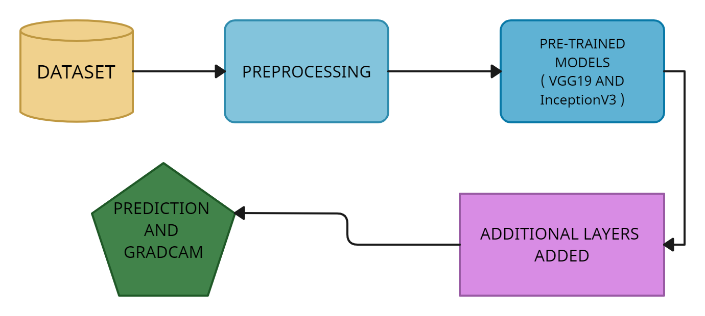
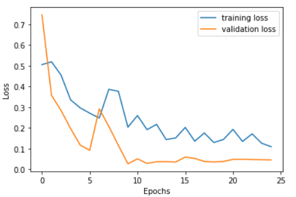
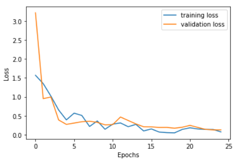

## Problem
Early and accurate brain tumor detection is crucial for effective treatment and improved patient outcomes.
Traditional methods using MRI images can be time-consuming and lack precision.
This project explores the use of deep learning to predict brain tumors from MRIs, aiming for faster and more accurate diagnosis.

## Data
Dataset: [link text](https://www.kaggle.com/datasets/navoneel/brain-mri-images-for-brain-tumor-detection)

Data Augmentation Techniques: Rotation, Flip, Translation, Scaling, Noise addition

## Methodology
Network Architecture: Transfer learning can be a useful technique for brain tumor prediction, as it allows leveraging pre-trained 
neural network models on large image datasets for a specific task to improve the accuracy of predictions on a smaller dataset with
limited samples. Two prevalent pre-trained neural network models used for brain tumor prediction are VGG19 and InceptionV3.

Visualization: We implemented Grad CAM, through which doctors and medical specialists can better apprehend how the prototype is making 
its predictions and identify the regions affected by the tumor.

## Results
Our experiments showed that the VGG19 and Inception V3 CNNs achieved high accuracy rates of 98% and 96%, respectively, 
for brain tumor classification. The models also achieved high precision, recall, and F1-score values, giving 
scores of 0.97, 0.97 and 0.98 respectively, indicating excellent performance in both tumor and non-tumor class identification. 

## Code
[link to notebook](Brain Tumor Prediction Code ICICCS661.ipynb)

## Conclusion
We suggested a paradigm for classifying brain tumors based using VGG19 and Inception V3 CNNs and 
the Grad-CAM technique for visualization and interpretation of the network's decision-making process. The obstacle of 
data size and diversity was solved using data augmentation as a part of our data pre-processing techniques. Our experiments 
imply that the framework achieved high accuracy and performance in predicting a tumor. Also, Image segmentation 
is important in medical image processing because medical images vary in their complexity. The Grad-CAM 
visualizations provided insights into the features and structures that the CNNs used to classify brain tumors, which 
could aid in the interpretation and diagnosis of brain tumors. To statistically analyze our model we included precision, 
recall, and f1-scores. This framework can be further extended by incorporating additional CNN models and exploring 
different visualization techniques to improve brain tumor classification accuracy and interpretability. The model can be 
further enhanced by getting more data and maybe also the use of three-dimension images which may help in better 
prediction of the tumor.

## Visualizations

